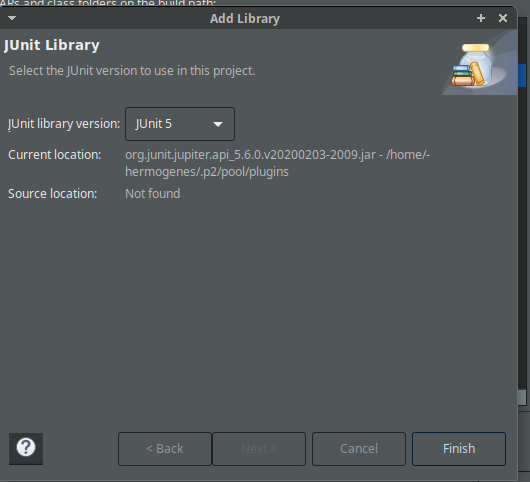
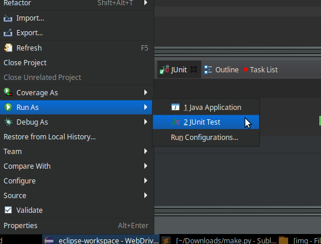
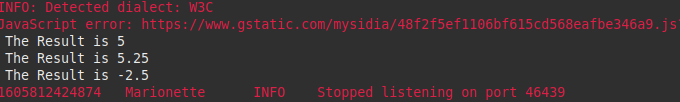
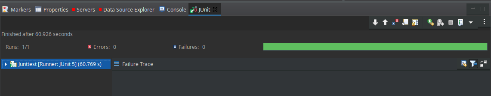

# SeleniumWebDriver-JUnit
JUnit es una librería desarrollada para poder probar el funcionamiento de las clases y métodos que componen nuestra aplicación, y asegurarnos de que se comportan como deben ante distintas situaciones de entrada.

## Casos de prueba 
- <b> Caso 1: Calcular el 10% de 50</b> <br>
   Entradas = 10% y 50 <br>
   Proceso = 10% of 50 = 0.1 × 50 <br>
   Resultado Esperado = 5
   
- <b> Caso 1: Calcular el 10.5% de 50</b> <br>
   Entradas = 10.5 y 50 <br>
   Proceso = 10.5% of 50 = 0.105 × 50  <br>
   Resultado Esperado = 5.25

- <b> Caso 1: Calcular el -5% de 50</b> <br>
   Entradas = -5 y 50 <br>
   Proceso = -5% of 50 = -0.05 × 50 = -2.5  <br>
   Resultado Esperado = -2.5


## Agregamos JUnit a nuestro proyecto

Cambiamos la Buil Path y en agregar librerias seleccionamos JUnit.



## Implementamos los scripts de prueba

Se usó el mismo codigo de la practica 05 agregando asserts.

``` java
import java.util.concurrent.TimeUnit;

import static org.junit.Assert.*;

import org.apache.commons.lang3.ArrayUtils;
import org.junit.Before;
import org.junit.jupiter.api.Test;
import org.openqa.selenium.*;
import org.openqa.selenium.firefox.FirefoxDriver;


public class Junttest {
@Test
public void junitTest(){
    System.setProperty("webdriver.gecko.driver","/home/hermogenes/eclipse-workspace/WebDriverDemo/geckodriver");

        WebDriver driver = new FirefoxDriver();
        //Puts an Implicit wait, Will wait for 10 seconds before throwing exception
        driver.manage().timeouts().implicitlyWait(10, TimeUnit.SECONDS);

        driver.navigate().to("http://www.calculator.net/");

        driver.manage().window().maximize();

        driver.findElement(By.xpath("/html/body/div[4]/div/table/tbody/tr/td[3]/div[2]/a")).click();

        driver.findElement(By.xpath("/html/body/div[3]/div[1]/table[2]/tbody/tr/td/div[3]/a")).click();

        String[] tests={"10","10.5","-5","a"};
        String[] resultArray= {};

        for(int i=0;i<tests.length-1;i++)
        {
            driver.findElement(By.id("cpar1")).sendKeys(tests[i]);
            driver.findElement(By.xpath("/html/body/div[3]/div[1]/table[1]/tbody/tr[2]/td/input[2]")).click();
            String result = driver.findElement(By.xpath("/html/body/div[3]/div[1]/p[2]/font/b")).getText();
            System.out.println(" The Result is " + result);
            resultArray = ArrayUtils.add(resultArray,result);
            driver.findElement(By.id("cpar1")).clear();

        }

        driver.close();

        String[] expectedArray = {"5","5.25","-2.5",""};

        assertEquals(resultArray[0], expectedArray[0]);
        assertEquals(resultArray[1], expectedArray[1]);
        assertEquals(resultArray[2], expectedArray[2]);
        //  assertEquals(resultArray[3], expectedArray[3]);
    }
}
``` 
## Ejecución

Se ejecuta la script como JUnit y esperamos los resultados.








