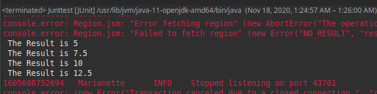

# SeleniumWebDriver-JUnit
JUnit es una librería desarrollada para poder probar el funcionamiento de las clases y métodos que componen nuestra aplicación, y asegurarnos de que se comportan como deben ante distintas situaciones de entrada.

## Agregamos JUnit a nuestro proyecto

Cambiamos la Buil Path y en agregar librerias seleccionamos JUnit.


## Implementamos los scripts de prueba

Se usó el mismo codigo de la practica 05 agregando asserts.

``` java
import java.util.concurrent.TimeUnit;

import static org.junit.Assert.*;

import org.apache.commons.lang3.ArrayUtils;
import org.junit.Before;
import org.junit.jupiter.api.Test;
import org.openqa.selenium.*;
import org.openqa.selenium.firefox.FirefoxDriver;


public class Junttest {
@Test
public void junitTest(){
    System.setProperty("webdriver.gecko.driver","/home/hermogenes/eclipse-workspace/WebDriverDemo/geckodriver");

    WebDriver driver = new FirefoxDriver();
    //Puts an Implicit wait, Will wait for 10 seconds before throwing exception
    driver.manage().timeouts().implicitlyWait(10, TimeUnit.SECONDS);

    driver.navigate().to("http://www.calculator.net/");

    driver.manage().window().maximize();

    driver.findElement(By.xpath("/html/body/div[4]/div/table/tbody/tr/td[3]/div[2]/a")).click();

    driver.findElement(By.xpath("/html/body/div[3]/div[1]/table[2]/tbody/tr/td/div[3]/a")).click();
    
    driver.findElement(By.id("cpar2")).sendKeys("50");
    String[] resultArray= {};
    
    for(int i=10;i<26;i=i+5)
    {
    	driver.findElement(By.id("cpar1")).sendKeys(Integer.toString(i));
        driver.findElement(By.xpath("/html/body/div[3]/div[1]/table[1]/tbody/tr[2]/td/input[2]")).click();
        String result = driver.findElement(By.xpath("/html/body/div[3]/div[1]/p[2]/font/b")).getText();
        System.out.println(" The Result is " + result);
        resultArray = ArrayUtils.add(resultArray,result);
        driver.findElement(By.id("cpar1")).clear();

    }
   
    driver.close();
    
    String[] expectedArray = {"5","7.5","10","12.5"};
    
    assertArrayEquals(expectedArray, resultArray);
}
}
``` 
## Ejecución

Se ejecuta la script como JUnit y esperamos los resultados.




